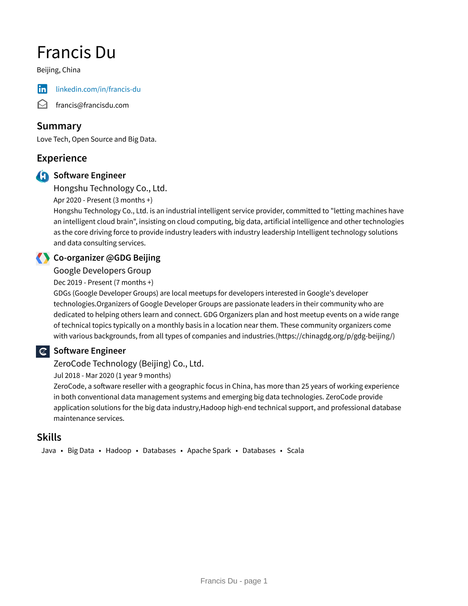

|  GitHub Stats   | Waketime Week Stats  |
|  ----  | ----  |
|   |  |

- 🔭 I’m currently working on [Koifish](https://github.com/trisasnava/koifish)

- 🌱 I’m currently learning [Rust](https://www.rust-lang.org/learn)

- 👯 I’m looking to collaborate on [Koifish](https://github.com/trisasnava/koifish)

- 📝 I regulary write articles on [https://francis.run](https://francis.run)

- 📄 Know about my experiences [https://francis.run/about/](https://francis.run/about/)

